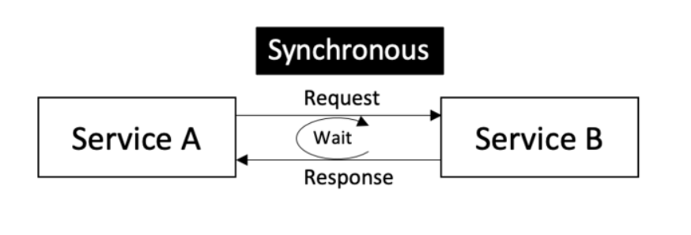

# Microservices

Microservices is an architectural style and approach to building software systems that structures an application as a collection of small, loosely coupled, and independently deployable services. In a microservices architecture, an application is broken down into multiple independent services, each responsible for performing a specific business capability.

### The main characteristics of microservices include:

1. **Loose coupling:** Microservices are designed to be loosely coupled, which means they are independent and can be developed, deployed, and scaled individually without affecting the entire system.

2. **Independently deployable:** Each microservice can be developed, tested, and deployed independently of other services. This allows for faster development cycles, easier maintenance, and the ability to scale individual services as needed.

3. **Single responsibility:** Each microservice focuses on a specific business capability or function, and it should ideally do it well. This promotes separation of concerns and modularity in the overall system.

4. **Communication via APIs:** Microservices communicate with each other through well-defined APIs (Application Programming Interfaces). This enables loose coupling and allows each service to be developed using different technologies or programming languages.

5. **Decentralized data management:** Each microservice can have its own dedicated database or data store, optimized for the specific needs of that service. This allows for data autonomy and scalability.

6. **Fault isolation:** If a microservice fails or experiences issues, it should not bring down the entire system. Failures are isolated to the specific service, reducing the impact on other services.

7. **Scalability:** Microservices can be individually scaled based on demand. Services experiencing high traffic or load can be scaled independently without affecting other services in the system.

8. **Continuous deployment and DevOps:** Microservices are well-suited for continuous deployment practices and DevOps methodologies. Each service can be developed, tested, and deployed separately, enabling faster release cycles and continuous delivery of new features.

Microservices offer several benefits, including increased flexibility, scalability, resilience, and the ability to adopt different technologies for different services. However, they also introduce challenges such as managing service interdependencies, ensuring data consistency, and handling communication and coordination between services.

Overall, microservices provide a way to build complex applications by breaking them down into smaller, manageable components that can be developed and deployed independently, leading to more agile and scalable systems.

